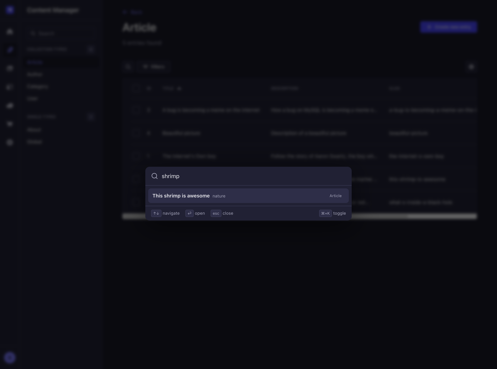

<p align="center">
  
</p>

<h1 align="center">Straplight</h1>

<p align="center">Spotlight-like search overlay for the Strapi admin panel. Press <strong>Cmd+K</strong> (or <strong>Ctrl+K</strong>) to instantly search across all your content types.</p>

<p align="center">
  
</p>

## Features

- **Cmd+K search overlay** — opens a search dialog from anywhere in the admin panel
- **Full-text search** — searches across all string fields (title, name, text, email, richtext, etc.) in your `api::` content types
- **Keyboard navigation** — use arrow keys to navigate results, Enter to open, Escape to close
- **Debounced search** with stale-response protection — fast and flicker-free
- **Dark and light theme** support — follows your Strapi admin theme
- **Configurable** — fine-tune search behavior and choose which content types are searchable via the settings page

## Installation

```bash
npm install straplight
# or
yarn add straplight
```

Add the plugin to your Strapi configuration:

```ts
// config/plugins.ts
export default () => ({
  straplight: {
    enabled: true,
  },
});
```

Rebuild your admin panel:

```bash
yarn build
yarn develop
```

## Usage

1. Press **Cmd+K** (macOS) or **Ctrl+K** (Windows/Linux) from anywhere in the admin panel
2. Start typing to search across all your content types
3. Use **Arrow Up/Down** to navigate results
4. Press **Enter** to open the selected entry in the Content Manager
5. Press **Escape** to close the overlay

## Settings

Navigate to **Settings > Straplight** in the admin panel to configure the plugin.

### General

| Setting | Description | Default |
| --- | --- | --- |
| **Delay** | Debounce delay in milliseconds before triggering a search | `200` |
| **Min characters** | Minimum query length required to trigger a search | `1` |

### Content Types

The content types table lets you control search behavior per content type:

- **Enabled** — toggle whether a content type is included in search results
- **Additional display fields** — choose up to 2 extra fields to show alongside the main field in search results (supports relations)

All `api::` content types are searchable by default.

## Compatibility

- Strapi v5 (5.x)
- Node.js >= 18

## License

[MIT](LICENSE)
